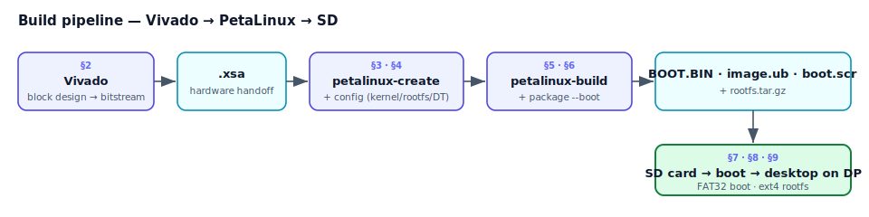
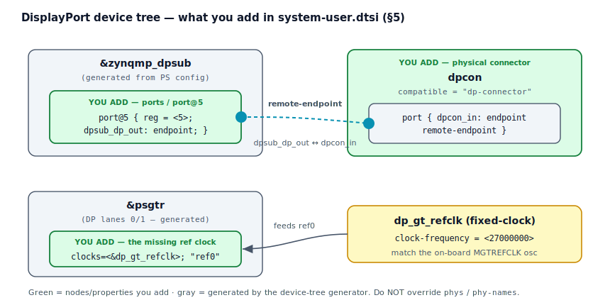
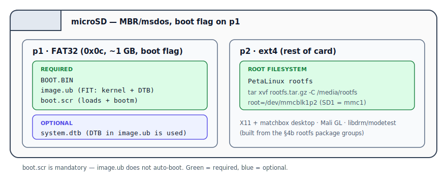
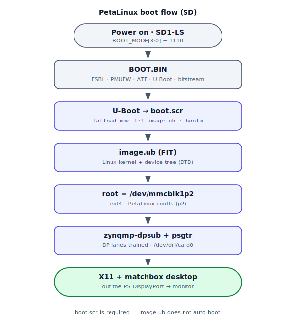

# PetaLinux Desktop + DisplayPort Bring-Up — K26 (xck26) Custom Carrier

**Author:** Chance Reimer

From-scratch guide to building a PetaLinux **2025.2** image for a custom K26 SOM
carrier, booting it from SD, getting a desktop out the DisplayPort, and getting
the board online through a PC. Adapted from Whitney Knitter's TE0802 desktop
guide, with the 2025.2 / K26-specific differences folded in (project creation,
DisplayPort device tree, `boot.scr`, boot mode, USB-Ethernet networking).

> **Why this differs from most online guides:** older guides target PetaLinux
> 2019.x (kernel 4.19) and use the legacy `xilinx_drm` DisplayPort binding and a
> 3-file SD card with no `boot.scr`. On 2025.2 the DisplayPort driver is the
> mainline `zynqmp-dpsub` (different device tree) and U-Boot's bootflow needs a
> `boot.scr`. Both are covered below.
>
> **Companion guide:** once this image builds and boots, the
> **[Ubuntu 24.04 distro guide](<LINK-TO-UBUNTU-REPO>)** runs Ubuntu's userspace over
> this same `BOOT.BIN` + device tree — this PetaLinux project is the `main` dependency
> that guide builds against.

---

## Contents

- [0. Target setup](#0-target-setup)
- [1. Environment setup (Linux)](#1-environment-setup-linux)
- [2. Hardware project (Vivado)](#2-hardware-project-vivado)
- [3. Create the PetaLinux project (from scratch)](#3-create-the-petalinux-project-from-scratch)
- [4. PetaLinux configuration](#4-petalinux-configuration)
- [5. Device tree — DisplayPort (the 2025.2 fix)](#5-device-tree--displayport-the-20252-fix)
- [6. Build](#6-build)
- [7. SD card layout](#7-sd-card-layout)
- [8. Boot mode & serial console](#8-boot-mode--serial-console)
- [9. First boot — verify DisplayPort](#9-first-boot--verify-displayport)
- [10. Networking — internet shared from a PC](#10-networking--internet-shared-from-a-pc)
- [Appendix — symptom -> cause -> fix (everything hit during bring-up)](#appendix--symptom---cause---fix-everything-hit-during-bring-up)

---

### Build pipeline

<p align="center">
  
</p>

---

## 0. Target setup

- **Board:** K26 SOM (`xck26`) on custom carrier
- **Tools:** Vivado 2025.2 + PetaLinux 2025.2 (Linux host)
- **Boot media:** SD card (SD 3.0 via on-board level shifter)
- **Display:** native PS DisplayPort -> monitor (no HDMI adapters — the dpsub
  driver is picky about them)
- **Network:** USB-to-Ethernet dongle, internet shared from a PC

---

## 1. Environment setup (Linux)

On Linux you **must** source each tool's environment script before any of its
commands exist on your PATH. 

- **Vivado / Vitis:** `settings64.sh`
- **PetaLinux:** `settings.sh`  (NOT `settings64.sh` — that's Vivado's)

```bash
# Vivado (adjust path to your install)
source /tools/Xilinx/Vivado/2025.2/settings64.sh

# PetaLinux (adjust path to your install)
source ~/petalinux/2025.2/settings.sh
```

**Don't run `petalinux-build` in a shell where you've sourced Vivado.** Vivado's
`settings64.sh` sets `LD_LIBRARY_PATH`, which bitbake (the build engine
`petalinux-build` wraps) refuses to run with. PetaLinux's own `settings.sh` does **not** set `LD_LIBRARY_PATH`, so
the problem only appears when Vivado is sourced in the same shell. It affects
`petalinux-build` specifically (not `petalinux-create` / `petalinux-config`).
Fix: keep PetaLinux work in its own shell, or just `unset LD_LIBRARY_PATH` before
building. The `~/.bashrc` aliases below keep the two environments cleanly
separate:

```bash
# ~/.bashrc
alias setup-vivado='source /tools/Xilinx/Vivado/2025.2/settings64.sh'
alias setup-petalinux='source ~/petalinux/2025.2/settings.sh'
```

Run `setup-vivado` in the terminal where you do Vivado work, and
`setup-petalinux` in the terminal where you run `petalinux-*` commands.

---

## 2. Hardware project (Vivado)

The Vivado project is checked in as a Tcl build script, not the generated
`.xpr`. You can use the GUI, or tcl script commands to rebuild the project.

### GUI

1. Launch Vivado: `vivado &`
2. In the **Tcl Console** at the bottom of the window, source the script:
   ```
   source /path/to/vivado_project/<project>.tcl
   ```
   The project rebuilds and opens.
3. Generate the bitstream: **Flow Navigator -> Generate Bitstream** (runs
   synthesis + implementation first).
4. Export hardware: **File -> Export -> Export Hardware…**, select **Include
   bitstream**, and write `<name>.xsa`.

### Batch (no GUI)

```bash
cd vivado_project
vivado -mode batch -source <project>.tcl       # recreates the .xpr + sources
# then, in a Tcl script or appended commands:
launch_runs impl_1 -to_step write_bitstream -jobs 8
wait_on_run impl_1
write_hw_platform -fixed -include_bit -force <name>.xsa
```

Either path ends with `<name>.xsa` — the hardware handoff PetaLinux builds
against. This Tcl + XSA pair is the source of truth for the hardware when
rebuilding from a fresh checkout.

---

## 3. Create the PetaLinux project (from scratch)

Source the PetaLinux environment first (§1: `settings.sh`). Create a fresh
project from the ZynqMP template, then import your XSA manually:

```bash
petalinux-create -t project --template zynqMP --name <proj>
cd <proj>
petalinux-config --get-hw-description /path/to/<name>.xsa
```

- `--template zynqMP` is the Zynq UltraScale+ / Kria template.
- `--get-hw-description` is the manual XSA import — point it at the `.xsa` file
  (or its directory); no `=` needed. It opens the top-level system config menu —
  just hit **Exit** (save when prompted), then do the targeted config in §4.

> If `petalinux-create -t project` errors on 2025.2, the newer subcommand form is
> `petalinux-create project --template zynqMP --name <proj>`.

---

## 4. PetaLinux configuration

### 4a. Kernel — `petalinux-config -c kernel`

Almost everything the desktop needs is **already enabled by default** in the
2025.2 BSP. The one thing you actually have to turn on is the USB mouse input
interface:

> **Device Drivers → Input device support →** enable **Mouse interface** and
> **Mice**.

That's the only required kernel change. Note: I also set a default resolution of **1920×1080** while in here (a near-universal DP mode), right after enabling the Mouse interface.

The list below is a **sanity-check
reference only** — things you can confirm are present, but should not need to
toggle. (Don't bother searching `CONFIG_DRM` in menuconfig; it returns dozens of
unrelated hits and none of them need changing.)

Display / GPU / DMA:
- `CONFIG_DRM`, `CONFIG_DRM_ZYNQMP_DPSUB` (mainline DisplayPort driver)
- `CONFIG_PHY_XILINX_ZYNQMP` (PS-GTR PHY driver — acquires the DP lanes)
- `CONFIG_XILINX_DPDMA`
- `CONFIG_CMA`, `CONFIG_DMA_CMA`

Input / HID:
- `CONFIG_INPUT_MOUSEDEV` (= "Mouse interface"), `CONFIG_INPUT_MOUSE` (= "Mice") ← the two you enable above
- `CONFIG_INPUT_EVDEV`, `CONFIG_INPUT_KEYBOARD`, `CONFIG_HID_GENERIC`, `CONFIG_USB_HID` (default-on)

USB / storage / video / audio (all default-on):
- `CONFIG_USB_STORAGE`, `CONFIG_USB_GADGET`
- `CONFIG_USB_VIDEO_CLASS`, `CONFIG_V4L_PLATFORM_DRIVERS`
- `CONFIG_SOUND`, `CONFIG_SND`, `CONFIG_SND_SOC`

**USB-Ethernet dongle:** your dongle already enumerated as `enu1u4c2`, so its
driver is already in the build — no toggle needed. Listed only for reference if
you swap dongles (match to chipset via `lsusb`): `CONFIG_USB_NET_AX88179_178A`
(ASIX), `CONFIG_USB_RTL8152` (Realtek), `CONFIG_USB_NET_CDCETHER` (generic).

### 4b. Root filesystem — `petalinux-config -c rootfs`

> Newer PetaLinux renamed these from `packagegroup-petalinux-*` to
> `packagegroup-xilinx-*` (plus standalone Yocto groups like `core-x11`). Names
> below match 2025.2.

**PetaLinux Package Groups — required for an X11 + matchbox desktop:**
- `core-x11`                  ← the X server foundation (just a bare server on its own)
- `packagegroup-xilinx-matchbox` ← window manager + desktop shell; without it X11 is unusable (no WM). Skip only for a single full-screen kiosk app.
- `packagegroup-xilinx-qt`    ← Qt runtime (Xilinx demo apps; Qt-on-X11)
- `packagegroup-xilinx-audio` ← DP / ALSA audio

**Optional (leave off unless needed):**
- `networking-stack` — NetworkManager / ssh / etc. You already have networking via the dongle, so this is just convenience.
- `multimedia` — gstreamer + codecs; only for video/multimedia playback (handy later for camera work, not needed for the desktop itself).

**Filesystem Packages → libs** — the Mali GPU lib is **not** in the package
groups above and is easy to miss; it's what gives accelerated X/Qt (vs software
rendering):
- `libmali-xlnx`
- `libmali-xlnx-dev`  (set `mali-backend-defaults = x11`)
- `libx11`, `libxdamage`, `libxext`, `libxfixes`

**Filesystem Packages → (DRM tools, for bring-up/debug):**
- `libdrm` and `libdrm-tests`  ← gives you `modetest` for verifying DP

**Image Features:**
- `package-management` — enables DNF on-target so you can `dnf install <pkg>`
  later without rebuilding. (Point `package-feed-urls` at a feed matching your
  PetaLinux version if you use it.)

---

## 5. Device tree — DisplayPort (the 2025.2 fix)

<p align="center">
  
</p>

Put this in `project-spec/meta-user/recipes-bsp/device-tree/files/system-user.dtsi`.
This is auto-included by the device-tree recipe — no `.bbappend` / `SRC_URI`
edits needed.

```dts
/include/ "system-conf.dtsi"

/ {
    /* GT reference clock feeding the DP PS-GTR lanes.
     * Frequency MUST match the on-board oscillator on the MGTREFCLK input
     * selected by the PS-config DP refclk (refclk index 0 here). */
    dp_gt_refclk: dp-gt-refclk {
        compatible = "fixed-clock";
        #clock-cells = <0>;
        clock-frequency = <27000000>;
    };

    /* Physical DP connector — the DTG can't know the carrier has one,
     * so we describe it and wire it to the DPSUB output. */
    dpcon {
        compatible = "dp-connector";
        label = "P1";          /* your connector ref-des */
        type = "full-size";    /* full-size / mini / micro */
        port {
            dpcon_in: endpoint { remote-endpoint = <&dpsub_dp_out>; };
        };
    };
};

/* Supply the GT reference clock the DTG left empty on the psgtr node. */
&psgtr {
    clocks = <&dp_gt_refclk>;
    clock-names = "ref0";
};

/* Add the DP output port (port@5) the mainline driver requires. */
&zynqmp_dpsub {
    ports {
        port@5 {
            reg = <5>;
            dpsub_dp_out: endpoint { remote-endpoint = <&dpcon_in>; };
        };
    };
};
```

**Do NOT:**
- Use the old `xilinx_drm` / `planes` / `gfx-layer` binding from 2019.x guides —
  the 2025.2 driver ignores it.
- Override `phys` / `phy-names` / `assigned-clock-rates` on `zynqmp_dpsub` — the
  device-tree generator already emits the correct values from your PS config
  (dual-lower, lanes 0/1). Hand-writing them caused the "failed to get PHY
  lane 0" regression.
- Use the `PHY_TYPE_DP` macro unless you also `#include
  <dt-bindings/phy/phy.h>` — and we don't need it here since we no longer set
  `phys`.

---

## 6. Build

```bash
petalinux-build
```

This regenerates the Linux device tree and `image.ub` (the FIT, which contains
the DTB). For a device-tree-only change you do **not** need a new BOOT.BIN —
BOOT.BIN holds FSBL/PMUFW/ATF/U-Boot/bitstream, none of which changed.

Generate the boot binary on the first build, and whenever firmware or the
bitstream changes:

```bash
petalinux-package --boot --u-boot --fpga --force
```

---

## 7. SD card layout

<p align="center">
  
</p>
 
Two partitions on the card:
1. **FAT32**, first partition, type `0x0c`, ~1 GB, boot flag set — holds BOOT.BIN / image.ub / boot.scr
2. **ext4**, rest of the card — the root filesystem
### Create the partitions (GParted)
 
1. Insert the SD card and identify its device — **carefully**, a wrong guess
   wipes the wrong disk:
```bash
   lsblk
```
   Find the card by size (`/dev/sdb` for a USB reader, `/dev/mmcblk0` for a
   built-in slot). The steps below call it `/dev/sdX`.
2. Launch GParted as root and pick the card from the device dropdown (top-right):
```bash
   sudo gparted
```
3. If GParted or your file manager auto-mounted any partition, right-click it →
   **Unmount**.
4. Fresh partition table: **Device → Create Partition Table… → msdos**. (ZynqMP's
   BootROM expects the FAT boot partition on an MBR/msdos disk.)
5. **Partition 1 — FAT32 boot:** right-click the unallocated space → **New**:
   - New size ≈ `1024` MiB
   - File system: **fat32**
   - Label: `BOOT` (optional) → **Add**
6. **Partition 2 — ext4 rootfs:** right-click the remaining unallocated space →
   **New**:
   - File system: **ext4**
   - Label: `rootfs` (optional) → **Add**
7. Click the green **✓ Apply All Operations** — GParted only queues changes until
   you apply.
8. Set the boot flag: right-click partition 1 → **Manage Flags** → check **boot**
   (and **lba**). GParted's fat32 maps to partition type `0x0c` (FAT32 LBA),
   which is what the BootROM looks for.
After applying you'll have `/dev/sdX1` (FAT32) and `/dev/sdX2` (ext4),
auto-mounted under something like `/run/media/$USER/BOOT` and
`/run/media/$USER/rootfs` (AlmaLinux/Fedora) or `/media/$USER/...` (Ubuntu) —
confirm with `findmnt` or `lsblk`.
 
### Boot files onto the FAT partition

**FAT partition must contain:**
- `BOOT.BIN`
- `image.ub`
- `boot.scr`  ← **REQUIRED.** Without it U-Boot's bootflow finds no OS payload,
  falls through every boot target (mmc -> JTAG -> QSPI -> NAND -> USB -> PXE), and
  dies. `image.ub` does not auto-boot; `boot.scr` is what loads and `bootm`s it.
- `system.dtb` (optional — the DTB inside `image.ub` is what's actually used on
  this path)

`petalinux-build` emits `boot.scr` into `images/linux/`. If you assemble the
card by hand, generate one:

```bash
# boot.cmd
setenv bootargs "console=ttyPS0,115200 earlycon root=/dev/mmcblk1p2 rw rootwait"
fatload mmc 1:1 0x10000000 image.ub
bootm 0x10000000
```
```bash
mkimage -c none -A arm64 -O linux -T script -d boot.cmd boot.scr
```

> Root device is `mmcblk1p2` because SD1 enumerates as `mmc1` here (U-Boot prints
> `mmc1 is current device`). Adjust if yours differs.

### rootfs onto the ext4 partition

```bash
sudo tar xvf images/linux/rootfs.tar.gz -C /media/rootfs/
sync
```

---

## 8. Boot mode & serial console

<p align="center">
  
</p>

Set the boot-mode straps to **SD1 with level shifter**:

```
BOOT_MODE[3:0] = 4'b1110   (SD1-LS, = 0xE)
```

Confirm it took — U-Boot prints this near the top of the log:

```
Bootmode: LVL_SHFT_SD_MODE1
```

`1110` is correct specifically because the SD path goes through the level
shifter. Plain SD1 (`0101`) is the non-level-shifted mode and is **not** what
this board uses.

Serial console:

| Setting        | Value          |
| -------------- | -------------- |
| Port (Windows) | `COM10`        |
| Port (Linux)   | `/dev/ttyUSB0` (or similar) |
| Baud           | `115200`       |
| Data/Parity/Stop | `8 / N / 1`  |
| Flow control   | none           |

PuTTY / Tera Term on Windows; `picocom -b 115200 /dev/ttyUSB0` or `screen
/dev/ttyUSB0 115200` on Linux.

---

## 9. First boot — verify DisplayPort

```bash
dmesg | grep -i -E "dpsub|drm"
```

Probe should be **clean** (no `-22` / "DP output port not connected" / "failed to
get PHY lane 0").

```bash
ls /dev/dri/                                   # expect card0 
for s in /sys/class/drm/card*-*/status; do echo "$s = $(cat $s)"; done
```

The connector should read `connected` once a monitor is attached and the link
trains.


### Troubleshooting (Only if display doesn't come on, over PUTTY or other serial monitor)

Force a test mode independent of X:

```bash
modetest -M zynqmp-dpsub                       # list connector/CRTC/modes
modetest -M zynqmp-dpsub -s <conn_id>@<crtc_id>:<mode>
```

If the monitor powers on but the desktop doesn't appear, restart the X service
now that a DRM output exists:

```bash
systemctl restart xserver-nodm
```

---

## 10. Networking — internet shared from a PC

Used when no router is in reach. The PC NATs its own internet (e.g. WiFi) down
the wired link to the board's USB-Ethernet dongle.

**On the PC (Linux / NetworkManager):** set the wired connection's IPv4 method
to *shared* — this auto-runs DHCP + DNS (dnsmasq) and NAT toward the board.

```bash
nmcli connection show                                 # find the wired conn name
nmcli connection modify "<conn-name>" ipv4.method shared
nmcli connection up "<conn-name>"
```

**On the PC (Windows):** Internet Connection Sharing — properties of the
*internet* adapter -> Sharing tab -> allow sharing, select the wired adapter.
Board lands on `192.168.137.x`.

**On the board:**

```bash
ip addr flush dev enu1u4c2          # clear any stale static/link-local addr
udhcpc -i enu1u4c2                  # pull a lease from the PC
ip route                           # expect: default via 10.42.0.1 (Linux share)
ping -c3 8.8.8.8                    # raw IP — routing test
ping -c3 google.com                # DNS test
```

If `8.8.8.8` works but `google.com` doesn't, it's DNS only:

```bash
echo "nameserver 8.8.8.8" >> /etc/resolv.conf
```

**Turn PC sharing OFF when you don't want it always on:**

```bash
nmcli connection down "<conn-name>"
nmcli connection modify "<conn-name>" connection.autoconnect no
```

Bring it back with `nmcli connection up "<conn-name>"` when needed. Note:
link-local-only on the PC gives PC<->board connectivity but **no internet** — use
*shared*, not link-local, when you want the board online.

---

## Appendix — symptom -> cause -> fix (everything hit during bring-up)

| Symptom | Cause | Fix |
| --- | --- | --- |
| `vivado` / `petalinux-*` "command not found" | Tool environment not sourced | `source settings64.sh` (Vivado) / `settings.sh` (PetaLinux) (§1) |
| `petalinux-build` aborts: "you probably need to unset LD_LIBRARY_PATH" | Vivado sourced in the same shell (its `settings64.sh` sets `LD_LIBRARY_PATH`) | `unset LD_LIBRARY_PATH` before building, or use a PetaLinux-only shell (§1) |
| U-Boot runs, then falls through to PXE and dies | No OS payload on FAT — `image.ub` alone doesn't auto-boot | Add `boot.scr` to the FAT partition (§7) |
| `dpsub: DP output port not connected`, probe `-22` | OF-graph DP output port missing | Add `dpcon` connector + `port@5` endpoint (§5) |
| `dpsub: failed to get PHY lane 0`, probe `-22` | `psgtr` node enabled but no reference clock; or a wrong hand-written `phys` | Add `clocks`/`clock-names="ref0"` to `&psgtr`; remove any `phys` override (§5) |
| dtc `syntax error` at the `phys` line | `PHY_TYPE_DP` macro not expanded (no `dt-bindings/phy/phy.h`) | Use numeric `6`, or `#include` the header — or drop `phys` entirely (§5) |
| Monitor powers on, no desktop | DRM output now exists but X started before it | `systemctl restart xserver-nodm` (§9) |
| `ping google.com` fails, dongle interface has only `inet6 fe80::` | No IPv4 — no DHCP server on a direct/link-local link | PC internet sharing + `udhcpc` on the board (§10) |
| `8.8.8.8` pings, `google.com` doesn't | DNS not configured | Add `nameserver` to `/etc/resolv.conf` (§10) |
