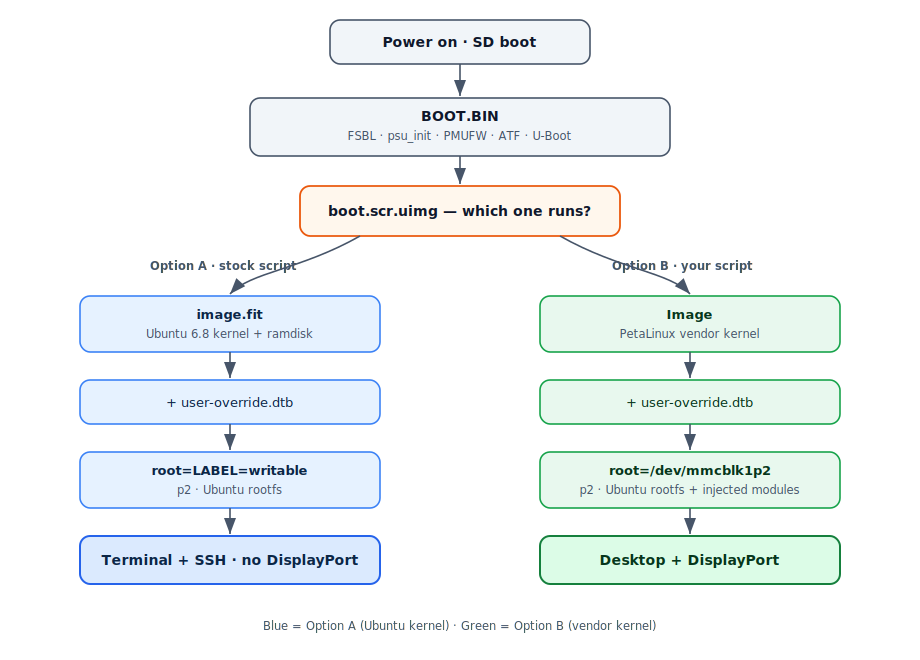
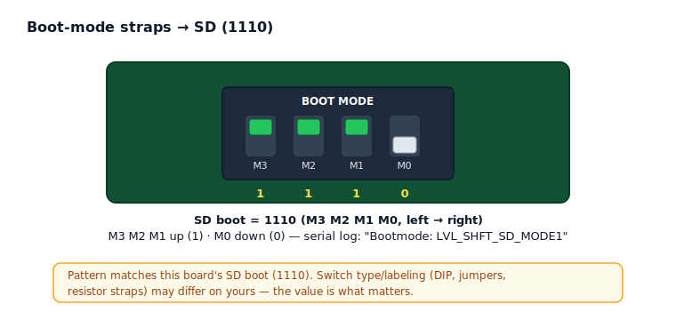
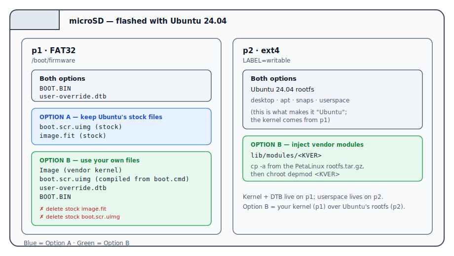

# Ubuntu 24.04 Bring-Up on Custom Kria K26 Carrier (SD Boot)

Run Ubuntu 24.04 LTS on a custom K26 carrier from SD, using a custom `BOOT.BIN` and a
patched device tree (`user-override.dtb`). **Two options, pick by whether you need a
display:**

| | **Option A — Headless (terminal + SSH)** | **Option B — Desktop + DisplayPort** |
| :--- | :--- | :--- |
| Kernel | Ubuntu's stock **6.8** (from `image.fit`) | PetaLinux **vendor kernel** (your `Image`) |
| DisplayPort | no | **yes** (`/dev/dri/card0`) |
| Kernel rebuild | **not needed** | needed (DP/media/squashfs config) |
| Copy `Image` + modules | **no** | yes |
| Boot files on FAT | keep Ubuntu's stock ones | replace with your own |
| Effort | minimal — just patch the DTB | full vendor-kernel swap |

Everything is reachable over the **serial console (115200 8N1)** in both options, and
over **SSH** once networking is up — so if you don't need a screen, Option A is all you
need. Option B is only for an actual DisplayPort desktop.

Both options share **Common Steps 1–2**, then branch.

### Boot flow at a glance

<p align="center">
   boot.scr.uimg, branching into Option A (Ubuntu kernel -> terminal/SSH) and Option B (vendor kernel -> desktop/DisplayPort)">
</p>

---

## Contents

- [Prerequisite: build the PetaLinux project first](#prerequisite-build-the-petalinux-project-first)
- [What you need](#what-you-need)
- [Hardware setup (board-specific)](#hardware-setup-board-specific)
- [Common Steps (both options)](#common-steps-both-options)
  - [Step 1 — Flash the Ubuntu 24.04 image](#step-1--flash-the-ubuntu-2404-image)
  - [Step 2 — Build user-override.dtb from system.dtb](#step-2--build-user-overridedtb-from-systemdtb)
- [**Option A — Headless: terminal + SSH**](#option-a--headless-terminal--ssh-ubuntu-stock-kernel)
  - [A1 — Copy two files to the FAT partition](#a1--copy-two-files-to-the-fat-partition-p1)
  - [A2 — Boot, then reach it over serial / SSH](#a2--boot-then-reach-it-over-serial--ssh)
  - [A3 — Verify](#a3--verify)
- [**Option B — Desktop + DisplayPort**](#option-b--desktop--displayport-petalinux-vendor-kernel)
  - [B1 — Build the PetaLinux kernel (menuconfig)](#b1--build-the-petalinux-kernel-with-the-right-config-menuconfig)
  - [B2 — Compile boot.scr.uimg from boot.cmd](#b2--compile-your-bootscruimg-from-bootcmd)
  - [B3 — Inject the vendor kernel modules](#b3--inject-the-vendor-kernel-modules-into-the-ubuntu-rootfs)
  - [B4 — Lay out the FAT boot partition](#b4--lay-out-the-fat-boot-partition-p1-remove-stock-add-yours)
  - [B5 — Boot & verify (DisplayPort)](#b5--boot--verify-desktop--displayport)
  - [B6 — Install the Kria desktop](#b6--install-the-kria-desktop-on-the-board)
- [Debug — model not found](#debug--if-the-model-isnt-found-unsupported-platform-)
- [Gotchas](#gotchas)
- [Repeatable build summary](#repeatable-build-summary)

> ↩ Each section ends with a [**↑ back to Contents**](#contents) link.

---

## Prerequisite: build the PetaLinux project first

This is the Ubuntu-distro branch; it consumes artifacts from the PetaLinux project
(`main`): **[PetaLinux project — `main`](<LINK-TO-PETALINUX-REPO>)**.

| Artifact | Needed by | Used for |
| :--- | :--- | :--- |
| `BOOT.BIN` | A + B | FSBL/`psu_init`, PMUFW, ATF, U-Boot for the carrier |
| `system.dtb` | A + B | hardware device tree → patched into `user-override.dtb` |
| `Image` | **B only** | the vendor kernel we boot for DisplayPort |
| `rootfs.tar.gz` | **B only** | source of `lib/modules/$KVER` injected into the rootfs |

For Option B, build the kernel with the config in **Step B1**.

> Branch layout: `main` = PetaLinux BSP/project (hardware + vendor kernel) ·
> this branch = Ubuntu 24.04 distro bring-up (userspace), dependent on `main`.

---

## What you need

- Custom carrier + K26 SOM, boot-mode straps set to **SD**
- From the PetaLinux build (`images/linux/`): `BOOT.BIN`, `system.dtb` (both options).
  For Option B also: `Image`, `rootfs.tar.gz`.
- **Ubuntu 24.04 Kria SD image** — https://ubuntu.com/download/amd
- microSD card (genuine, decent quality)
- Micro-USB cable for the serial console: **115200 8N1**, port `ttyPS0`
- Linux host with `dtc` (both) + `mkimage` (Option B):
  `apt install device-tree-compiler u-boot-tools`

---

## Hardware setup (board-specific)

Two physical things before any boot. The strap setting is board-specific (diagram
below); the serial console is just a micro-USB cable.

**Boot-mode straps → SD.** Set your carrier's boot-mode straps to SD boot — value
**1110**, read left → right M3 M2 M1 M0 (M3/M2/M1 up = 1, M0 down = 0):

<p align="center">
  
</p>

> Switch type/labeling (DIP, jumpers, resistor straps) can differ on your board — the
> **value 1110** is what matters. The serial log confirms a correct setting with
> `Bootmode: LVL_SHFT_SD_MODE1`.

**Serial console.** Plug the board's **micro-USB** console port into your host —
that's the whole hookup. Open a terminal at **115200 8N1** (it enumerates as a USB
serial port on the host; on the board it's `ttyPS0`). This is your console for both
options, and how you drive the B6 desktop install.

[↑ back to Contents](#contents)

---

# Common Steps (both options)

## Step 1 — Flash the Ubuntu 24.04 image

Etcher (or `dd`) the image. Produces:

- **p1** — FAT32 boot partition (`/boot/firmware`): holds Ubuntu's `boot.scr.uimg` +
  `image.fit`. Option A keeps these; Option B deletes them.
- **p2** — ext4 `writable` partition = Ubuntu rootfs (`LABEL=writable`).

### SD layout (what lands where, per option)

<p align="center">
  
</p>

## Step 2 — Build `user-override.dtb` from `system.dtb`

```bash
dtc -I dtb -O dts system.dtb -o uo.dts
```

**a) Disable SD write-protect.** Prevents the SD coming up read-only at the block level
(root mounts `ro` → `systemd-remount-fs` fails → emergency mode → no usable system).

> **REQUIRED for Option A** (Ubuntu's 6.8 kernel exhibits the read-only behavior).
> Harmless / usually unnecessary for Option B (the vendor kernel mounts rw without it),
> but fine to leave in.

```dts
mmc@ff170000 {            /* SD = mmcblk1 */
    ...
    disable-wp;
};
mmc@ff160000 {            /* eMMC = mmcblk0 — optional */
    ...
    disable-wp;
};
```

> ⚠️ `disable-wp` with a **HYPHEN**. `disable_wp` (underscore) is silently ignored.

**b) Set a recognizable model string.** Ubuntu's `flash-kernel` (runs on `apt` kernel
operations) reads `/proc/device-tree/model`; empty/unknown → `Unsupported platform ''`
wedges `apt`. Needed for **both** options (both use `apt`). Add to the **root `/ {`
node**:

```dts
/ {
    compatible = "xlnx,zynqmp";
    model = "ZynqMP K26";        /* ADD THIS — directly in the root node */
    ...
};
```

> The `*` in flash-kernel db entries (`ZynqMP K26*`) is a **glob wildcard**.
> `ZynqMP K26` satisfies it — **do not** include the `*`.

Recompile:

```bash
dtc -I dts -O dtb uo.dts -o user-override.dtb
```

[↑ back to Contents](#contents)

---

# Option A — Headless: terminal + SSH (Ubuntu stock kernel)

No kernel rebuild, no `Image`, no module copy. You boot Ubuntu's own 6.8 kernel via the
stock `image.fit`, and its boot script auto-loads your `user-override.dtb`. (Snaps work
out of the box here — Ubuntu's kernel has squashfs built in.)

## A1 — Copy two files to the FAT partition (p1)

Leave Ubuntu's stock `boot.scr.uimg` and `image.fit` **in place**. Just add:

```bash
FAT=/media/<user>/system-boot             # auto-mounted vfat p1 (verify: findmnt "$FAT")
sudo cp BOOT.BIN          "$FAT/BOOT.BIN"
sudo cp user-override.dtb "$FAT/user-override.dtb"
```

The stock script's `user-override.dtb` hook uses your DTB in place of the reference one.

## A2 — Boot, then reach it over serial / SSH

1. Boot-mode straps to **SD**, insert card, serial at **115200 8N1**, power on.
2. Boot flow: your `BOOT.BIN` U-Boot → stock `boot.scr.uimg` → `image.fit` (Ubuntu 6.8
   kernel) + your `user-override.dtb` → `root=LABEL=writable` → login.

Default login: `ubuntu` / `ubuntu` (forces password change first time).

**SSH** (Ubuntu Kria server image ships openssh; networking is the USB-ethernet on this
carrier):

```bash
ip a                                  # find the address (USB eth: cdc_ncm / ax88179)
sudo systemctl enable --now ssh       # if it isn't already running
# from your workstation:
ssh ubuntu@<board-ip>
```

## A3 — Verify

```bash
uname -r                 # 6.8.0-xxxx-xilinx (Ubuntu kernel)
cat /etc/os-release      # Ubuntu 24.04
findmnt /                # /dev/mmcblk1p2, rw   <-- rw = disable-wp took
cat /proc/device-tree/model   # ZynqMP K26
```

Done — full headless Ubuntu 24.04 over serial/SSH. No DisplayPort (use Option B for
that).

[↑ back to Contents](#contents)

---

# Option B — Desktop + DisplayPort (PetaLinux vendor kernel)

Ubuntu's 6.8 kernel does **not** drive DisplayPort on this tree. The same
`user-override.dtb` + `BOOT.BIN` drive DP correctly under the **PetaLinux vendor
kernel** — so we boot your `Image` over the Ubuntu rootfs. This adds a kernel rebuild,
`Image` + module injection, and replacing the stock boot files.

## B1 — Build the PetaLinux kernel with the right config (menuconfig)

In `petalinux-config -c kernel` confirm at least:

```
CONFIG_DRM=y
CONFIG_DRM_ZYNQMP_DPSUB=y          # the DP DRM driver (=y so it's built-in, no .ko race)
CONFIG_PHY_XILINX_ZYNQMP=y         # PS-GTR phy for DP
CONFIG_DRM_KMS_HELPER=y
CONFIG_MEDIA_SUPPORT=y             # media / V4L2 subsystem
CONFIG_VIDEO_DEV=y
CONFIG_MMC=y / CONFIG_MMC_SDHCI=y / CONFIG_EXT4_FS=y   # built-in (needed for no-initrd root mount)
CONFIG_SQUASHFS=y                  # REQUIRED for snapd/snaps (Firefox is a snap)
CONFIG_SQUASHFS_XZ=y               # snaps are xz-compressed
CONFIG_SQUASHFS_ZSTD=y             # newer snaps use zstd — enable both
CONFIG_SQUASHFS_LZO=y              # harmless, covers older snaps
CONFIG_BLK_DEV_LOOP=y              # snaps mount via loop devices
```

> **Snap / Firefox:** Ubuntu 24.04 ships Firefox (and others) as **snaps** = squashfs
> images snapd loop-mounts. PetaLinux's default kernel omits squashfs, so the vendor
> kernel gives `unknown filesystem squashfs` / `snapd not fully supported`. The
> `CONFIG_SQUASHFS*` + `CONFIG_BLK_DEV_LOOP=y` above fix it (build **`=y`** — snapd
> mounts very early). (This is *only* a vendor-kernel problem; Ubuntu's own kernel in
> Option A already has squashfs.) Alternative: install Firefox from Mozilla's `.deb`.

> Also enable the media (V4L2) subsystem in the kernel and the GStreamer userspace
> (`petalinux-config -c rootfs` → `gstreamer1.0*` / `libdrm`) so the desktop + video
> pipeline have what they need. Build DP/DRM **`=y`**, not `=m`.

> **Kernel-config changes only touch `Image` + `lib/modules` — NOT
> `user-override.dtb`.** squashfs, loop, DP/DRM, media all live in the `Image`. The DTB
> carries only hardware description (Step 2). After any kernel rebuild: redeploy the new
> `Image` (B4) and re-inject the matching `lib/modules/$KVER` (B3) **together**, and
> leave `user-override.dtb` alone. Re-check `$KVER` — the git suffix can change.

## B2 — Compile your `boot.scr.uimg` from `boot.cmd`

Author the script as text, then `mkimage` it. This loads your `Image` +
`user-override.dtb` and mounts the Ubuntu rootfs directly (no initrd):

`boot.cmd`:

```text
# Vendor kernel + your dtb + Ubuntu 24.04 rootfs
echo "== Vendor kernel + user-override.dtb + Ubuntu rootfs =="
load mmc 1:1 0x70000000 user-override.dtb        # your DTB (proven DP-good)
load mmc 1:1 0x00200000 Image                     # your PetaLinux uncompressed kernel
setenv bootargs "root=/dev/mmcblk1p2 rootwait rw earlycon console=ttyPS0,115200 console=tty1 cma=512M"
booti 0x00200000 - 0x70000000
```

Compile `.cmd` → `.scr.uimg`:

```bash
mkimage -A arm64 -O linux -T script -C none -d boot.cmd boot.scr.uimg
```

`mmc 1:1` = SD/FAT. `booti <kernel> - <dtb>` — the `-` = **no initrd** (why the kernel
needs MMC/ext4 built-in, B1). `root=/dev/mmcblk1p2` = the Ubuntu writable partition.

## B3 — Inject the vendor kernel modules into the Ubuntu rootfs

The kernel looks for its modules in `/lib/modules/<version>`. Pulling one subdir
straight out of the tarball is fiddly (`./lib/...` vs `lib/...` path matching), so just
**extract the whole tarball into its own directory, then look inside `lib/modules/` to
see the version name**, and copy that directory over.

```bash
# 1. extract the whole rootfs tarball into its own scratch dir on the HOST
mkdir -p ~/petalinux-rootfs
sudo tar xzf images/linux/rootfs.tar.gz -C ~/petalinux-rootfs

# 2. look at what's in lib/modules — the printed dir name IS your kernel version
ls ~/petalinux-rootfs/lib/modules/
#   -> e.g.  6.12.40-xilinx-g31626ef92ff1
```

Take whatever that prints and copy it onto the Ubuntu writable partition (p2), then
rebuild the module db for it:

```bash
KVER=6.12.40-xilinx-g31626ef92ff1         # <- paste the exact name 'ls' printed above
ROOT=/media/<user>/writable               # auto-mounted ext4 p2 (verify: findmnt "$ROOT")

sudo cp -a ~/petalinux-rootfs/lib/modules/"$KVER" "$ROOT/lib/modules/"   # -a preserves symlinks/perms
sudo chroot "$ROOT" depmod "$KVER"        # rebuild module db for YOUR kernel inside Ubuntu's rootfs
```

> The version from `ls lib/modules/` must match your kernel's `uname -r` exactly
> (git suffix included) — that's why we read it off the extracted tree instead of
> typing it. Use `cp -a` (not plain `cp`) so the `build`/`source` symlinks `depmod`
> needs survive; the chroot `depmod` makes the modules resolvable for your kernel.

## B4 — Lay out the FAT boot partition (p1): remove stock, add yours

```bash
FAT=/media/<user>/system-boot             # vfat p1 (verify: findmnt "$FAT")

# REMOVE the Ubuntu-flash boot files (back up first) — these are for Ubuntu's kernel
sudo mv "$FAT/image.fit"      "$FAT/image.fit.ubuntu"
sudo mv "$FAT/boot.scr.uimg"  "$FAT/boot.scr.uimg.ubuntu"

# ADD yours
sudo cp BOOT.BIN              "$FAT/BOOT.BIN"            # if not already there
sudo cp images/linux/Image    "$FAT/Image"
sudo cp user-override.dtb     "$FAT/user-override.dtb"
sudo cp boot.scr.uimg         "$FAT/boot.scr.uimg"       # the one compiled in B2
```

FAT root must now contain exactly these four for boot — `BOOT.BIN`, `Image`,
`user-override.dtb`, your `boot.scr.uimg` — and **not** the stock `image.fit` /
`boot.scr.uimg` (now `*.ubuntu` backups).

## B5 — Boot & verify (desktop + DisplayPort)

1. Straps to **SD**, insert, serial at **115200 8N1**, power on.
2. Boot flow: your `BOOT.BIN` U-Boot → your `boot.scr.uimg` → `Image` +
   `user-override.dtb` → `root=/dev/mmcblk1p2` → Ubuntu 24.04 on the vendor kernel.

```bash
uname -r            # 6.12.40-xilinx-g31626ef92ff1  -> YOUR kernel
findmnt /           # /dev/mmcblk1p2, ext4, rw
ls /dev/dri/        # card0 + renderD128            -> DisplayPort alive
dmesg | grep -iE 'dpsub|psgtr|drm|card'
```

If `/dev/dri/card0` is present but no desktop: `sudo systemctl restart gdm3`.

> `Unable to mount root fs` / panic at mount → vendor kernel lacks built-in MMC or ext4;
> rebuild with `CONFIG_MMC*` / `CONFIG_EXT4_FS=y` (B1), or add an initrd to the script.

## B6 — Install the Kria desktop (on the board)

`/dev/dri/card0` from B5 means the DP **pipe** is alive, but you still need a desktop
environment to draw on it. Install `ubuntu-desktop-kria` **on the running board**.

> **Run this over the serial console (USB-to-UART)** — the GUI isn't up yet, so the
> serial session (or SSH) is how you drive the board for this step. **The board must
> have working internet access** — `apt` pulls a large amount here. Confirm first:
> `ping -c1 archive.ubuntu.com` (and `ip a` to check you have an address).

> ⚠️ **Hold the kernel + flash-kernel BEFORE the upgrade.** `apt upgrade` can pull a new
> Ubuntu `linux-image` and trigger `flash-kernel` to rewrite `image.fit` /
> `boot.scr.uimg` — clobbering the boot files you set up in B4. Pin them first:
> ```bash
> sudo apt-mark hold flash-kernel linux-image-xilinx-zynqmp linux-image-6.8.0-1029-xilinx
> ```

Add the Xilinx/Kria PPAs, update, and install the desktop:

```bash
sudo add-apt-repository ppa:xilinx-apps --yes &&
sudo add-apt-repository ppa:ubuntu-xilinx/default --yes &&
sudo add-apt-repository ppa:xilinx-apps/xilinx-drivers --yes &&
sudo add-apt-repository ppa:lely/ppa --yes &&
sudo apt update --yes &&
sudo apt upgrade --yes

sudo apt update
sudo apt install ubuntu-desktop-kria
sudo reboot
```

After the reboot the desktop should come up on the DisplayPort monitor. If you reach a
login/terminal but no GUI with `/dev/dri/card0` present, start the display manager:
`sudo systemctl restart gdm3`.

> Firefox and other snaps need squashfs in the **vendor** kernel (B1). If
> `ubuntu-desktop-kria` brings in snaps and you see `unknown filesystem squashfs`, that
> kernel config is missing — rebuild per B1.

> **Firefox snap may need reinstalling.** If Firefox was installed while the kernel
> lacked squashfs (so its snap mount failed), it can stay broken even after you add
> squashfs and reboot. Reinstall it once the vendor kernel has squashfs support:
> ```bash
> sudo snap remove firefox
> sudo snap install firefox
> ```
> Verify snaps mount at all with `snap list` and `mount | grep snapd` (should show
> squashfs loop mounts). If you'd rather skip snap entirely, install Firefox from
> Mozilla's `.deb` repo instead.

[↑ back to Contents](#contents)

---

## Debug — if the model isn't found (`Unsupported platform ''`)

```bash
cat /proc/device-tree/model; echo                       # live value (e.g. "ZynqMP K26")
dtc -I dtb -O dts user-override.dtb | grep -m1 'model =' # value compiled into the DTB
grep -i 'Machine:' /usr/share/flash-kernel/db/all.db | sort -u   # accepted patterns
```

```bash
m=$(cat /proc/device-tree/model)
case "$m" in
  "ZynqMP K26"*) echo "matches ZynqMP K26* -> OK" ;;
  *) echo "no match: '$m'" ;;
esac
```

Unexpected value = wrong/stale DTB live — recheck `user-override.dtb` on the FAT.

[↑ back to Contents](#contents)

---

## Gotchas

- **Option A vs B:** headless terminal/SSH = Option A (Ubuntu kernel, just patch the
  DTB). DisplayPort = Option B (vendor kernel, the full swap). Don't do B's kernel
  rebuild / `Image` copy if you only need a terminal.
- **`disable-wp` not `disable_wp`** — hyphen, or silently ignored. Required for Option A.
- **`model`** must be non-empty and match a flash-kernel db pattern (root `/ {` node),
  or `apt` breaks. The `*` is a wildcard — use `ZynqMP K26`, not `ZynqMP K26*`. Both
  options.
- **(B) DP needs the vendor kernel** — Ubuntu's 6.8 won't drive it on this tree.
- **(B) Snaps need squashfs in the vendor kernel** — `unknown filesystem squashfs`
  means `CONFIG_SQUASHFS=y` + `CONFIG_BLK_DEV_LOOP=y` are missing (B1). Ubuntu's own
  kernel (Option A) already has squashfs.
- **(B) Delete the stock boot files** — `image.fit` + stock `boot.scr.uimg`; boot your
  own. **(A) keep them.**
- **(B) Module dir must match `uname -r` exactly** (git suffix included); `cp -a` +
  chroot `depmod`. Redeploy `Image` + `lib/modules` together after any kernel rebuild.
- **Use a genuine SD card.**
- **Hold apt's kernel/flash-kernel** so `apt` can't desync things:
  `sudo apt-mark hold flash-kernel linux-image-6.8.0-1029-xilinx`

[↑ back to Contents](#contents)

---

## Repeatable build summary

**Common:** build `main` PetaLinux → `BOOT.BIN`, `system.dtb` → flash Ubuntu 24.04 →
patch DTB (`disable-wp` + `model = "ZynqMP K26"`) → `user-override.dtb`.

**Option A (headless):** FAT p1 = keep stock `image.fit`/`boot.scr.uimg`, add `BOOT.BIN`
+ `user-override.dtb` → boot → terminal/SSH on Ubuntu's 6.8 kernel.

**Option B (display):** build kernel with B1 config (DP/media/squashfs/MMC/ext4) →
`Image`, `rootfs.tar.gz` → compile `boot.scr.uimg` from `boot.cmd` (B2) → inject
`lib/modules/$KVER` into rootfs (B3) → FAT p1: remove stock `image.fit`/`boot.scr.uimg`,
add `BOOT.BIN` + `Image` + `user-override.dtb` + your `boot.scr.uimg` (B4) → boot &
verify `/dev/dri/card0` (B5) → on the board (serial console, internet required): hold
the kernel, add the Xilinx PPAs, `apt install ubuntu-desktop-kria`, reboot (B6) →
desktop + DisplayPort + snaps.

[↑ back to Contents](#contents)
